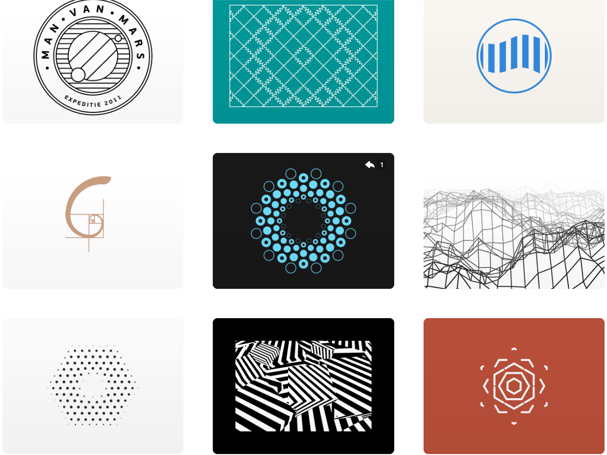

# fliu0820_quiz8

# **Part 1**


create by ***Dave Whyte***

This artwork by Dave Whyte is a showcase of infinite loops and changes through dynamic visual art. The artwork uses colour gradients as well as changing fluid effects to create an evolving visual experience. Our assignment can also be made with elements that are similar in appearance and position to create an interactive relationship. The colour changes in this project are very smooth and enhance the sense of dynamism and depth of the work. This dynamic approach and effect can help us create new interface layouts or motion animations. It can also inspire us to achieve more continuous and smooth interactions in the assignment.



Other Works of ***Dave Whyte***

[Link to ***Dave Whyte's*** page](https://dribbble.com/beesandbombs)L

# **Part 2**

I've discovered that we can use the noise() function in p5.js to generate smoother, continuous variations of randomness. This function is based on three optional parameters - X, Y, and Z coordinates - that define points in a multi-dimensional space.

```
function setup() {
  createCanvas(600, 600);
}

let t = 0
let rez = 0.05
function draw() {
  background(220);
  noStroke();
  for(i = 0; i < height; i+=3){
    for(j = 0; j < width; j+=3){
      var n = noise(i*rez,j*rez, t)
      var n1 = noise(j*rez, t, i*rez)
      var n2 = noise(t,j*rez,i*rez)
      fill(n*255, n1*255, n2*255)
      rect(i,j,3)
    }
    t += 0.0003
  }
}

```

Therefore it is possible to insert shapes or other parameters into these values to shape the variations we want. We can use this function to create dynamically changing backgrounds or textures with a more natural visual flow rather than a random, staccato effect.T