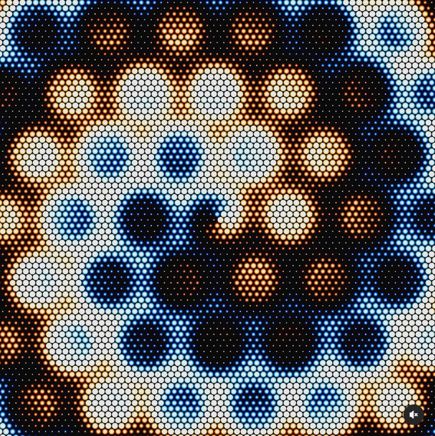

# fliu0820_quiz8

# **Part 1**

create by ***Dave Whyte***

This artwork by Dave Whyte is a showcase of infinite loops and changes through dynamic visual art. The artwork uses colour gradients as well as changing fluid effects to create an evolving visual experience. Our assignment can also be made with elements that are similar in appearance and position to create an interactive relationship. The colour changes in this project are very smooth and enhance the sense of dynamism and depth of the work. This dynamic approach and effect can help us create new interface layouts or motion animations. It can also inspire us to achieve more continuous and smooth interactions in the assignment.

